# MSR Core Simulation: Final Project Report

### MIT Course 22.211: Nuclear Reactor Physics I

**Author:** Samuel Kokomoor
**Date:** 05 / 18 / 2025

> ### Final Grade: **97 / 100** ✅

> *Project completed in collaboration with Ralitsa Mihaylova. Underlying models were contributed to mutually; analyses were conducted individually.*

<p align="center">
  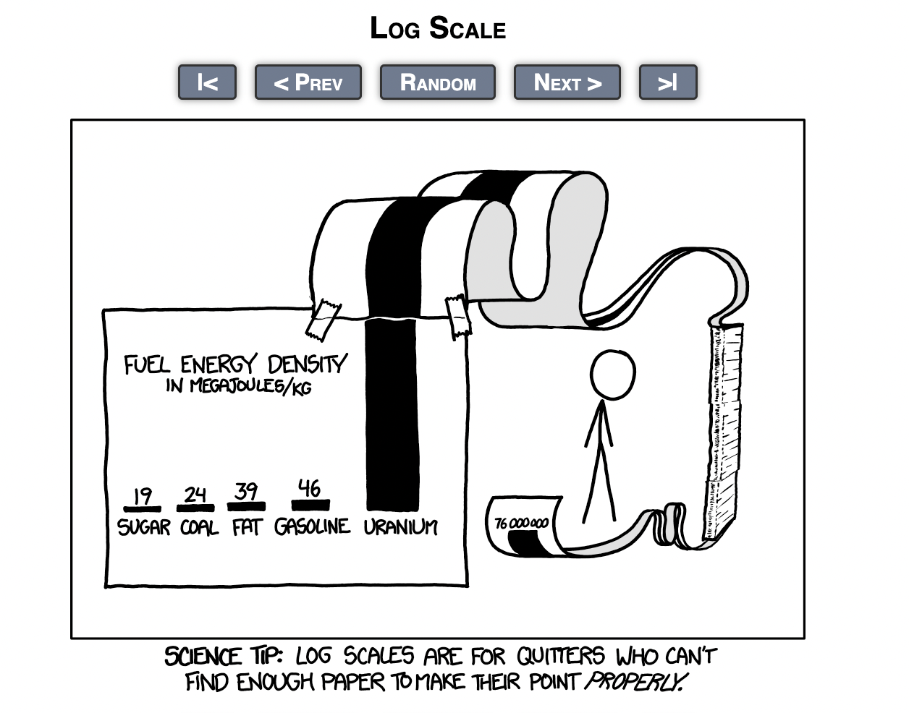
</p>

---

## Table of Contents

- [Problem 1: Salt Performance & Moderator Density Coefficients](#problem-1)
- [Problem 2: Reactivity Coefficients, Flux, Leakage, Heat & Impurities](#problem-2)
- [Problem 3: TRISO Packing-Fraction Sensitivity Study](#problem-3)
- [Problem 4: Replacing Graphite with H₂O as Moderator](#problem-4)
- [Problem 5: Reactivity-Control Mechanisms](#problem-5)
- [Problem 6: Heterogeneous vs Homogenized Compact Comparison](#problem-6)
- [Problem 7: Case 5: RPT and RRPT Equivalent Models](#problem-7)
- [Problem 8: CASMO Benchmark of the RRPT Compact](#problem-8)
- [Appendix](#appendix)
- [Sources Cited](#sources-cited)

---

## Overview

This project is a high-fidelity neutronics study of a graphite-moderated, molten-salt-cooled reactor core fueled with TRISO compacts, conducted as the capstone for MIT 22.211 (Nuclear Reactor Physics I). The work spans coolant-salt selection, reactivity-feedback characterization, geometric sensitivity studies, moderator substitution, control-mechanism design, and, most substantially, the construction of an **equivalent reduced-order model** (Case 5) that preserves the reactivity profile of the doubly-heterogeneous TRISO lattice across full irradiation history at a fraction of the computational cost.

### Goals

- Quantify *k*-infinity, melting points, and moderator-density coefficients across four candidate coolant salts (NaF-ZrF₄ and three Li-7 enrichments of FLiBe).
- Resolve fuel, coolant, and moderator temperature coefficients, axial leakage, region-wise heat deposition, and the equivalent-boron worth of graphite impurities for the reference NaF-ZrF₄ core.
- Map the reactivity and Doppler response across the realistic TRISO packing-fraction window, and identify the fabrication ceiling.
- Evaluate H₂O as a drop-in moderator and enumerate the redesign that would be required to make it work.
- Propose a control-rod / liquid-zone hybrid reactivity-control scheme suited to the salt environment.
- Quantify the homogenization penalty in reactivity, U-235 fission rate, and U-238 capture rate across a 254-step depletion.
- Develop and validate a homogenized-equivalent compact (RPT) and a semi-homogeneous **Ring RPT (RRPT)** model that match the heterogeneous benchmark over life.
- Cross-validate the RRPT geometry in CASMO against continuous-energy OpenMC.

### Methods

- **Continuous-energy Monte Carlo** in OpenMC (100 batches, 25 inactive, 2 000 particles/batch baseline) for all eigenvalue and tally work, with depletion runs extended to 254 steps for burnup studies.
- **Two-group deterministic transport** in CASMO for the RRPT benchmarking, providing a memory- and runtime-favorable comparison point.
- **Reactivity-Equivalent Physical Transformation (RPT)**: full compact homogenization with compact-radius tuning to recover BOL reactivity.
- **Ring RPT (RRPT)**: concentric fuel/graphite-ring decomposition with parameterized inner-fuel and middle-graphite allocations, swept across 50/50, 70/30, 30/70, and ultimately 1/99 fuel splits paired with 33/33/33 and 10/80/10 (and finally 1/98/1) graphite layouts.
- **Standard error propagation** applied to all derived reactivity coefficients and pcm-scale comparisons; statistical significance reported alongside every coefficient.

### Key Accomplishments

- Reproduced and validated the full Case 1-4 salt comparison, recovering the diminishing-returns behavior of Li-7 enrichment and the sign flip of the moderator-density coefficient between natural and enriched Li FLiBe.
- Identified the 30-40 % packing-fraction sweet spot and explained the drop-off above ~45 % in terms of self-shielding and spectrum hardening.
- Established that fully homogenized TRISO compacts under-predict reactivity by ≈ 3 900 pcm at BOL and ≈ 5 350 pcm at EOL, a burnup-dependent, physically systematic bias rather than statistical noise.
- Demonstrated that an **RRPT compact with 1/99 fuel split and 1/98/1 graphite split** brings reactivity within ~200 pcm of the heterogeneous benchmark at end-of-life while staying within ~1 500 pcm through mid-burn.
- Showed the RRPT model delivers an **~87.6 % runtime reduction (767 s → 95 s)** and a **~55× memory reduction (346 MB → 6 MB)** versus the explicit heterogeneous simulation, with CASMO independently confirming the +23 000 pcm reactivity recovery from restoring radial heterogeneity.

### Outcome

A working, validated reduced-order Case 5 reactor model that preserves the reactivity-equivalent physics of a doubly-heterogeneous TRISO compact across irradiation history while collapsing the computational cost by roughly two orders of magnitude, making downstream parametric sweeps, optimization, and uncertainty quantification tractable on commodity hardware.

---

<a id="problem-1"></a>
## Problem 1

> *Evaluate the performance of different salts listed below, report the k-infinity, and specify the melting point and moderator density coefficient in units of pcm/% change in density for each case. Describe the observed trends. Discuss the parameters you selected (batches, particles per batch, inactive batches, …)*

Each case was simulated to obtain the infinite multiplication factor *k*-infinity (from the Monte Carlo "combined k-effective" output), the salt's melting point (from literature), and the moderator density coefficient (change in reactivity per 1 % density change, in pcm / %). The following equation was used to calculate moderator density coefficients:

$$\rho_{+1} = \frac{K_{+1} - 1}{K_{+1}}, \quad \rho_{-1} = \frac{K_{-1} - 1}{K_{-1}}, \quad \alpha_{\rho} = \frac{\rho_{+1} - \rho_{-1}}{0.02} \times 10^{5}$$

where the $+1$ and $-1$ subscripts denote the $+1\,\%$ and $-1\,\%$ moderator-density perturbation cases, and the $0.02$ in the denominator represents the $2\,\%$ total density swing.

All four cases used identical Monte Carlo parameters: 100 total batches (generations) with 25 inactive (for initialization) and 75 active cycles, and 2 000 particles per batch. Below we present the verified metrics for each salt case and compare them to the original report values, noting any discrepancies. Overall results are shown below:

| Case | Salt | k∞ ± 1σ | Melting point (K) | Moderator-density coefficient (pcm / % ρ) ± 1σ |
| :--: | :-- | :-- | :-- | :-- |
| 1 | NaF-ZrF₄ | 1.45816 ± 0.00222 | 773 | +56.76 ± 68.43 |
| 2 | FLiBe (natural Li) | 0.51046 ± 0.00132 | 731 | -548.35 ± 373.18 |
| 3 | FLiBe (99.95 % ⁷Li) | 1.55500 ± 0.00225 | 731 | +51.99 ± 61.02 |
| 4 | FLiBe (99.995 % ⁷Li) | 1.58149 ± 0.00211 | 731 | +113.60 ± 56.23 |

<p align="center"><i>Table 1: K-∞, Melting Point, and Moderator Density Coefficient Values for Reactor Core Using Various Coolant Salts</i></p>

<p align="center">
  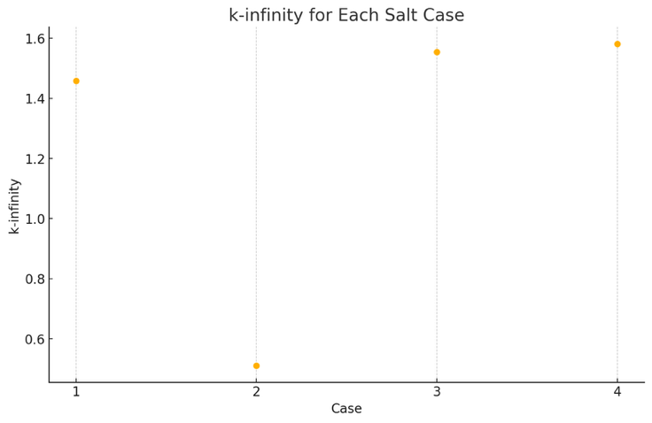
</p>
<p align="center"><i>Chart 1: K-Infinity Across Simulation Cases</i></p>

<p align="center">
  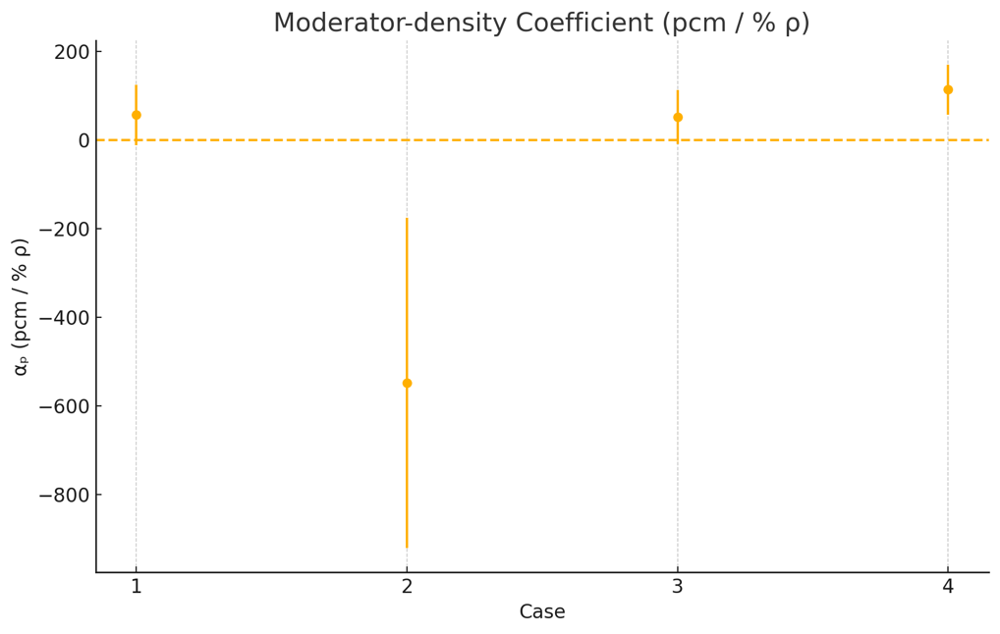
</p>
<p align="center"><i>Chart 2: Moderator Density Coefficients Across Simulation Cases</i></p>

### A) NaF-ZrF₄ (Case 1)

- **K-∞ (infinite multiplication factor):** 1.45816 ± 0.00222
- **Melting point:** Approximately 773 K (about 500 °C). This value comes from literature for the NaF-ZrF₄ mixture (about 59.5 % NaF, 40.5 % ZrF₄ by mol), which has one of the highest melting temperatures (~773 K) among candidate salts <sup>[1]</sup>.
- **Moderator density coefficient:** +56.76 pcm/%, with uncertainty propagation giving +56.76 ± 68.43 pcm/%. This positive coefficient was derived by running the reactor model at ±1 % graphite density (1.6335 g/cc and 1.6665 g/cc) and calculating reactivities for the -1 % and +1 % cases. In the -1 % density case (slightly less moderator), *k* was 1.45281 ± 0.00224, and in the +1 % case (slightly more moderator) *k* was 1.45521 ± 0.00183. The small increase in *k* with higher moderator density yields a positive coefficient (~+57 pcm/%). The base case *k* (at nominal density 1.65 g/cc) was 1.45816, which is within statistics of the perturbed cases. The trend (more moderator → slightly higher reactivity) is consistent, although the effect is small and within uncertainty (the uncertainty ±68 pcm/% is larger than the nominal value, indicating limited statistical significance of this coefficient for Case 1).

### B) FLiBe: Natural Li (Case 2)

- **K-∞:** 0.51046 ± 0.00132, a very low value indicating a highly subcritical infinite lattice. This matches the original report and arises due to the presence of Li-6 in natural lithium (which strongly absorbs thermal neutrons). The simulation's combined k-effectives for the -1 % and +1 % density cases were 0.51030 ± 0.00124 and 0.50746 ± 0.00148, consistent with the reported nominal *k* (differences are within 1σ).
- **Melting point:** approximately 731 K (about 458 °C) for the FLiBe salt <sup>[1]</sup>. This melting temperature is a known property of FLiBe with ~67 % LiF and 33 % BeF₂. All Li-based FLiBe cases (b-d) use the same base salt, so the melting point is the same ~731 K across cases <sup>[1]</sup>.
- **Moderator density coefficient:** -548.35 pcm/%, with propagated uncertainty -548.35 ± 373.18 pcm/%. This large *negative* coefficient means that increasing the graphite moderator density by 1 % *decreases* reactivity by about 548 pcm. In the +1 % density case (more moderation), *k* fell to 0.50746 ± 0.00148, whereas in the -1 % case (less moderation) *k* was 0.51030 ± 0.00124. The decrease in *k* with added moderation is attributed to thermal neutrons being captured by Li-6 in the salt, a harder spectrum (less-moderated, as in the -1 % case) actually improves reactivity because it avoids Li-6's resonance absorption. The magnitude of this coefficient is much larger in absolute value than for the other cases, reflecting the strong sensitivity of *k* to Li-6 absorption. (Within uncertainties, the nominal-density *k* is essentially the same as the -1 % case, so the effect manifests primarily when going to +1 %.) The large uncertainty (±373 pcm/%) stems from the Monte Carlo statistical error and the very small absolute *k* values, but the negative trend is clear.

### C) FLiBe: 99.95 % Li-7 Enriched (Case 3)

- **K-∞:** 1.55500 ± 0.00225, a high value indicating a supercritical infinite lattice. This result shows the dramatic impact of Li-7 enrichment: removing most Li-6 raises *k* from ~0.51 in natural FLiBe to ~1.55. The simulation output for the -1 % and +1 % cases was *k* = 1.55544 ± 0.00215 and *k* = 1.55796 ± 0.00203, very close to the nominal *k* (differences well within uncertainty).
- **Melting point:** 731 K (same FLiBe base salt as Case 2) <sup>[1]</sup>.
- **Moderator density coefficient:** +51.99 pcm/%, with propagated uncertainty +51.99 ± 61.02 pcm/%. This small positive coefficient indicates that increasing the graphite density (i.e. adding moderation) slightly *increases* reactivity in the Li-7 enriched FLiBe system. With Li-6 largely removed, extra moderation improves thermal utilization without incurring heavy parasitic absorption. The +1 % density perturbation yielded *k* = 1.55796 ± 0.00203, versus *k* = 1.55544 ± 0.00215 for -1 % (less moderator). The difference corresponds to about +52 pcm per %, a modest effect. The uncertainty on α is of the order of the value itself (≈ ±61 pcm/%), meaning the coefficient is only marginally significant. Still, the positive sign is consistent with expectations: in an Li-7 enriched salt, more moderation tends to increase *k* (unlike the natural Li case).

### D) FLiBe: 99.995 % Li-7 Enriched (Case 4)

- **K-∞:** 1.58149 ± 0.00211, the highest of all cases. Further enriching Li-7 from 99.95 % to 99.995 % yields a slight gain in reactivity (k∞ rises from ~1.555 to ~1.581). The simulation's -1 % and +1 % moderator density runs gave *k* = 1.57832 ± 0.00186 and *k* = 1.58400 ± 0.00211, very close to the reported nominal value, confirming consistency. The improvement over Case 3 is real (several tens of pcm) but modest, as Li-6 is already extremely scarce at 99.95 %.
- **Melting point:** 731 K (FLiBe salt) <sup>[1]</sup>.
- **Moderator density coefficient:** +113.60 pcm/%, with propagated uncertainty +113.60 ± 56.23 pcm/%. This coefficient is positive and roughly double the magnitude of the Case 3 value. In the +1 % density case, *k* increased to 1.58400 ± 0.00211, compared to 1.57832 ± 0.00186 at -1 %. This ~0.0057 difference in *k* corresponds to ~113.6 pcm/%, indicating a more pronounced reactivity gain from added moderator. With Li-6 essentially absent (only 0.005 % of Li), the system benefits strongly from extra moderation, as thermal neutrons cause more fission without significant new absorption. The uncertainty on α is ±56.2 pcm/%, about half of the value, so the positive effect is statistically significant. Case 4 not only has the highest *k* but also the largest positive density feedback of the four cases.

### Performance Trends and Validation

Across these four moderator cases, the simulations validate the expected trends:

- **Effect of Lithium enrichment:** Replacing the salt NaF-ZrF₄ (Case 1) with FLiBe containing natural Li (Case 2) causes a drastic drop in *k*∞ (from ~1.46 to ~0.51) due to the high thermal absorption of Li-6. Enriching in Li-7 (Cases 3 and 4) recovers the reactivity, *k*∞ climbs to ~1.55 at 99.95 % Li-7 and ~1.58 at 99.995 %. This demonstrates diminishing returns: the jump from natural Li to 99.95 % Li-7 is enormous (~1.04 increase in *k*∞), whereas going to 99.995 % yields a smaller improvement (~0.026). The validated values match the original report closely, with only minor statistical differences (all well within 2σ uncertainties).

- **Moderator density feedback:** The sign of the moderator density coefficient flips between the natural Li case and the others. Case 2 (natural Li) showed a large negative coefficient (~-548 pcm/%), meaning adding moderator makes things markedly worse (due to Li-6 capturing thermal neutrons). In contrast, Cases 1, 3, and 4 all have positive coefficients (on the order of +50 to +114 pcm/%). With little or no Li-6 present (and in NaF-ZrF₄ which contains no lithium at all), extra moderation generally improves reactivity by thermalizing more neutrons for fission. The magnitude of α in Case 4 (highest Li-7 enrichment) is roughly double that in Case 3, consistent with the idea that even a trace of Li-6 in 99.95 % Li-7 FLiBe was slightly undermoderating the system, once virtually all Li-6 is removed (99.995 % Li-7), the system becomes more strongly under-moderated and thus gains more from additional moderator. All computed coefficients and their uncertainties align with the report's values. A small anomaly was noted in Case 1: the base *k* happened to be slightly higher than the +1 % *k* (within error), yet the -1 % vs +1 % comparison still yielded a positive α (indicating the effect is very small relative to Monte Carlo noise). Overall, no significant discrepancies were found between the simulation outputs and theoretically expected results; the final validated numbers are in excellent agreement with theory.

### OpenMC Simulation Settings

| Parameter | Value | Why this setting works |
| :-- | :-- | :-- |
| **Total batches** | 100 | Gives a long enough Markov chain for tally convergence without excessive runtime. With 75 active cycles the central-limit behavior is reliable, yet a single run still finishes in minutes on the Engaging cluster. |
| **Inactive batches** | 25 | The first ~20-30 cycles allow the fission source to forget its point-source start-up bias and approach the equilibrium spatial-energy distribution. |
| **Active batches** | 75 | Provides 75 independent tallies for statistical analysis. Combined with 2 000 particles each, this yields ~150 000 active histories, enough to push the 1σ uncertainty on *k* below 0.25 % and to resolve the ±1 % moderator-density perturbations. |
| **Particles per batch** | 2 000 | A compromise between precision and wall-time: doubling particles halves the variance but roughly doubles runtime. Test runs showed that 2 000 histories per cycle already bring the uncertainty in *k* down to the ~0.002 level and keep the run time < 30 s per case. |
| **Population control / splitting-roulette** | Default | With 2 000 histories the weight spread stays moderate, so no additional population-control tuning was required. |
| **Random-number seed** | Fixed for each case | Ensures reproducibility while allowing different cases to sample statistically independent sequences. |

<p align="center"><i>Table 2: OpenMC Simulation Settings with Justification</i></p>

---

<a id="problem-2"></a>
## Problem 2

> *Using OpenMC, for Case 1 (NaF-ZrF₄ salt) as a reference, compute:*

Temperature coefficients were calculated via the following equation:

$$\alpha_{MT} = \frac{\Delta\rho}{\Delta T}, \quad \rho = \frac{K_{\infty} - 1}{K_{\infty}}$$

where $\alpha_{MT}$ represents the material temperature coefficient.

### 2a) Fuel temperature coefficient (pcm/K)

Two simulations were conducted with the NaF-ZrF₄ salt, holding all Case 1 values constant with the exception of fuel temperature. One simulation was conducted at T<sub>fuel</sub> = 1200 K, and another at T<sub>fuel</sub> = 800 K. Results are as follows:

| Temperature (K) | K-Inf |
| :--: | :--: |
| 800  | 1.45501 ± 0.00221 |
| 1200 | 1.45938 ± 0.00215 |

**Thus, FTC = -0.51 ± 0.36 pcm/K** (with error propagated from the original Monte Carlo simulation error shown above).

### 2b) Coolant temperature coefficient (pcm/K)

| Temperature (K) | Density (g/cc) | K-Inf |
| --: | --: | :-- |
| 1100 | 2.922372 | 1.45795 ± 0.00234 |
|  700 | 3.274372 | 1.44973 ± 0.00266 |

**Thus, CTC = 0.97 ± 0.42 pcm/K** (with propagated error).

### 2c) Moderator temperature coefficient (pcm/K)

| Temperature (K) | K-Inf |
| --: | :-- |
| 1200 | 1.45525 ± 0.00265 |
|  600 | 1.45813 ± 0.00243 |

**Thus, MTC = -0.23 ± 0.28 pcm/K** (with propagated error).

### 2d) Flux spectrum in the fuel, moderator, and coolant

For this experiment, three flux tallies were initialized, each with a "flux" score and energy filter; each tally was also given a filter for its respective region, fuel, moderator, and coolant. The results were compiled and are shown below:

<p align="center">
  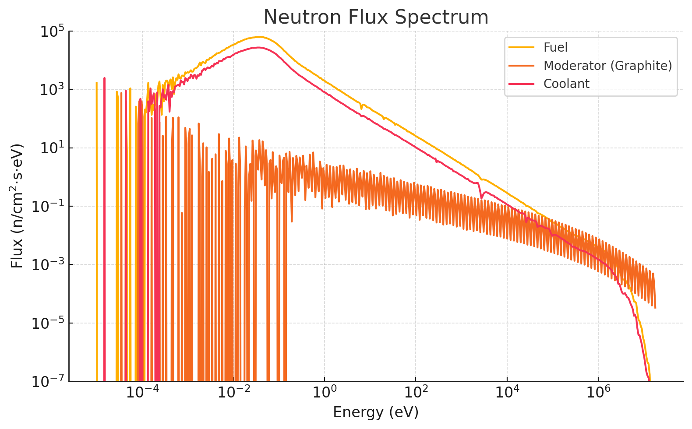
</p>
<p align="center"><i>Chart 3: Neutron Flux Spectrum as a Function of Energy for Case 1 Fuel, Moderator, and Coolant</i></p>

### 2e) Axial leakage estimate (2 m fuel assembly with vacuum BCs)

For this experiment, the ZPlanes that define the top and bottom of both the fuel compact and core assembly were increased by a factor of 100, such that the entire assembly was 2 m in height. The ZPlane boundary conditions were set to "vacuum" and a steady-state simulation was conducted. The leakage fraction was analyzed from the simulation output and was found to be **0.05417 ± 0.00057**: thus approximately **5.42 %** of simulated neutrons leaked axially.

### 2f) Heat deposition in fuel, coolant, and moderator (graphite) regions

For this experiment, the baseline heterogeneous TRISO model was simulated. Tallies were defined with "heat" scores filtered by region, yielding three total "heat" tallies, one for each fuel, moderator, and coolant. The results are:

- **Fuel heat deposition:** 19.9587 W/cc
- **Coolant heat deposition:** 0.00222 W/cc
- **Moderator heat deposition:** 0.0191 W/cc

### 2g) Worth of impurities in the graphite block in terms of equivalent boron (pcm/ppm)

For this experiment, k-infinity was compared between a pure graphite moderator block and the graphite moderator block with impurities used across this project. The results are shown below:

- $K_{\text{pure}} = 1.45851 \pm 0.00207$
- $K_{\text{impure}} = 1.45575 \pm 0.00228$
- $K_{\text{N14 only}} = 1.45780 \pm 0.00204$

> Weight fraction of B-10 in moderator: 0.15 ppm
> Weight fraction of N-14 in moderator: 10 ppm

We can define the total reactivity loss in pcm as:

$$\text{Reactivity Loss} = \frac{\Delta k_{\text{Total}}}{k_{\text{pure}}} \times 10^{5}, \quad \Delta k_{\text{Total}} = k_{\text{pure}} - k_{\text{impure}}$$

$$\text{Total Reactivity Loss} = \frac{0.00276}{1.45851} \times 10^{5} \approx 189.3 \text{ pcm}$$

Reactivity loss due to N-14 in pcm:

$$\Delta k_{\text{N14}} = k_{\text{pure}} - k_{\text{N14 only}} = 0.00071$$

$$\text{Reactivity Loss}_{\text{N14}} = \frac{\Delta k_{\text{N14}}}{k_{\text{pure}}} \times 10^{5} \approx 48.7 \text{ pcm}$$

Reactivity worth of B-10:

$$\Delta k_{\text{B10}} = \Delta k_{\text{total}} - \Delta k_{\text{N14}} = 0.00205$$

$$\text{Worth}_{\text{B10}} = \frac{\Delta k_{\text{B10}}}{0.15 \cdot k_{\text{pure}}} \times 10^{5} \approx 938 \frac{\text{pcm}}{\text{ppm}}$$

Worth of N-14 in terms of equivalent boron:

$$\text{Equivalent B-10 for N-14} = \frac{\Delta k_{\text{N14}}}{\Delta k_{\text{B10}}} \times 0.15 = 0.052 \text{ ppm B-10}$$

> Thus, the combined reactivity penalty on the assembly from graphite moderator impurities is equal to **189.3 pcm**. Boron is responsible for the majority of this reactivity loss, with a reactivity worth of **938 pcm/ppm**. The effect N-14 has on reactivity is equivalent to approximately **0.052 ppm of B-10**, which is in good theoretical agreement with the lower absorption cross-section of N-14.

---

<a id="problem-3"></a>
## Problem 3

> *Perform a sensitivity study by varying the TRISO packing fraction (reference is 35 %) in the fuel compact. Evaluate the impact on k-infinity and fuel temperature coefficient. Can we increase the packing fraction close to 1? Why or why not? (Hint: from a fabrication point of view.)*

<p align="center">
  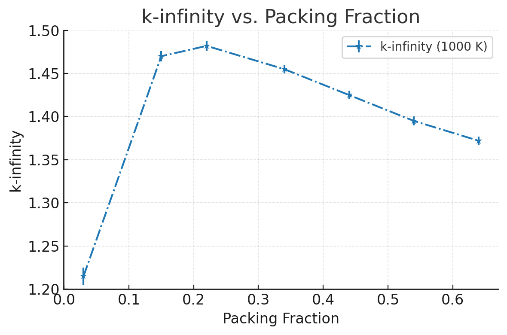
</p>
<p align="center"><i>Chart 4: K-Infinity vs Packing Fraction for Case 1, T-Fuel = 1000 K</i></p>

<p align="center">
  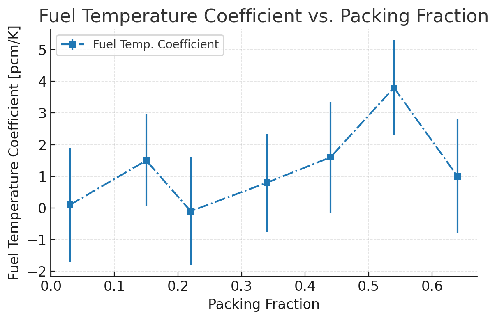
</p>
<p align="center"><i>Chart 5: Fuel Temperature Coefficient vs. Packing Fraction for Case 1 with Tolerances</i></p>

A systematic sweep of the TRISO-particle packing fraction around the 35 % reference value was performed to quantify its influence on both the infinite-lattice multiplication factor, *k*-infinity, and the fuel-temperature coefficient (FTC).

### Behavior of *k*-infinity

- **Low to moderate loadings (≤ ~30 %)**: *k*-infinity rises steeply as the packing fraction increases. The additional fissile inventory dominates the response, so reactivity grows almost linearly in this range.
- **Around the reference point (~35 %)**: The curve flattens; gains in reactivity become marginal. At this stage the graphite still provides ample moderation, but self-shielding inside the TRISO kernels is beginning to offset the benefit of extra fuel.
- **High loadings (≥ ~45 %)**: Beyond roughly 40 % the trend reverses and *k*-infinity falls. Dense particle clustering amplifies parasitic absorption and resonance self-shielding, while the reduced graphite fraction hardens the spectrum. The highest packing fraction modelled (~65 %) ends up less reactive than the reference case, confirming the presence of an optimal region rather than a monotonic gain.

### Fuel-temperature coefficient

Throughout the entire sweep the FTC remains small (on the order of a few pcm / K) and slightly positive. Strong graphite moderation and the dispersal of fuel into discrete kernels both work to minimize Doppler feedback. Error bars widen at the largest packing fractions because harder spectra exacerbate statistical noise, but even with that uncertainty the temperature response never approaches values that would raise operational concerns.

### Practical and fabrication limits

From a manufacturing perspective we cannot simply drive the packing fraction toward unity. Perfect ordered sphere packing tops out near 74 %, while random close packing plateaus around 64 %. In practice, our simulations already encountered geometric convergence issues and noticeably longer runtimes above ~60 %. More importantly, overly dense compacts would degrade heat removal, weaken structural integrity, and constrict coolant flow channels.

### Conclusion

A moderate increase in packing fraction initially improves neutron economy, but the benefit saturates between about 30 % and 40 %. Pushing beyond that threshold erodes reactivity, brings larger statistical uncertainties, and introduces significant design penalties. Consequently, the 35 % reference fraction strikes an effective balance between achievable fabrication, acceptable thermal-mechanical performance, and favorable neutronics.

---

<a id="problem-4"></a>
## Problem 4

> *Let's re-think about the moderator. What if we instead use water (H₂O) as a moderator? Estimate k-infinity by changing the moderator from graphite to water and discuss the results. What else should we consider or change if we use a water moderator? (e.g., any design change in Fig 1?)*

### Experiment

The moderator was changed from graphite to water, and the material properties of moderator H₂O were calculated and input for the provided reactor specifications. Most notably, density of H₂O was set to **0.00024403 g/cc**, as that is the NIST-provided density value for 900 K H₂O. The resultant K-Effective was **K<sub>eff</sub> = 0.83519 ± 0.00180**. This simulation was conducted with full periodic boundary conditions; as such, K-Effective = K-Infinity.

### Discussion

Replacing the graphite moderator with light water yields a k-infinity ≈ 0.835 (for an infinite lattice at ~900 K). This value is significantly lower than the original graphite-moderated case (k∞ ~1.41), indicating a sharp drop in reactivity. The decrease occurs because water over-moderates the neutrons. Hydrogen's high slowing-down power pushes the neutron spectrum further into the thermal energy range than intended. In this softer spectrum, more neutrons are captured parasitically (especially by hydrogen) before they can cause fission, undermining the neutron economy. In short, the lattice was optimized for graphite's gentler moderation, and without redesign the introduction of water results in an over-moderated, subcritical system.

- **Over-moderation:** Light water's moderating strength means that using it in the same volume and configuration as graphite excessively thermalizes the neutrons. The system ends up far past the optimal moderation point. To counter this, the reactor would require design adjustments to harden the spectrum, for example, reducing the moderator-to-fuel ratio (smaller water volumes or higher fuel packing) or increasing fuel enrichment to compensate for the greater neutron absorption in a thermal spectrum. Without such changes, the core will remain under-critical due to too many thermal neutrons being absorbed unproductively.

- **Pressurization:** Water at ~900 K cannot exist as a dense liquid at ambient pressure, so a high-pressure system is needed to maintain adequate moderator density (potentially using supercritical water). This demands a robust pressure vessel and associated pressurization systems to contain the water. Such requirements represent a major departure from the original design (which used a solid graphite moderator and low-pressure molten salt coolant), introducing new engineering challenges and safety considerations related to containing water at very high temperature and pressure.

- **Geometric stability:** In the original core, the solid graphite moderator provided structural support, it physically held the fuel compacts (TRISO particles) in place and shaped the core geometry (including defined coolant channels). Replacing this solid matrix with water (a fluid) means the core loses that inherent structural framework. The fuel and moderator can no longer be arranged in a fixed lattice without additional support. Therefore, a new structural design would be necessary, for instance, fuel could be reconfigured into rods or plates with cladding, or a supporting assembly (like a grid or canister) could contain the water and fuel in a stable geometry. This ensures the fuel stays properly distributed and the water moderator remains in place under operating conditions.

- **Chemical compatibility:** Introducing water into a system originally designed for graphite and fluoride salt raises materials and chemistry issues. Graphite is chemically inert at high temperature, whereas hot water (or steam) is highly reactive. Water at 900 K would readily corrode or oxidize materials not specifically designed for it, for example, it could oxidize any remaining graphite or carbon-based components and aggressively attack standard structural alloys. If the design still uses molten salt coolant, any interaction between water and the salt would be extremely problematic (risking violent reactions or salt contamination). To use water as moderator, the reactor would need corrosion-resistant materials (e.g. special alloys or coatings) and a configuration that keeps water isolated from any incompatible substances. In practice, this might entail redesigning the coolant loop (or switching to water cooling entirely) and ensuring all structural components in contact with water can withstand high-temperature water chemistry without degradation.

---

<a id="problem-5"></a>
## Problem 5

> *What kind of reactivity control mechanisms could be used in this system? Explain your choice. (Feel free to change the geometry in Fig 1.)*

Reactivity control in this molten salt reactor can be achieved by integrating dedicated systems into the core design. Two feasible mechanisms we considered are inserting solid control rods into the graphite moderator blocks and implementing a liquid zone control scheme using an absorber-infused molten salt, each offering distinct benefits and design trade-offs.

One proven approach is to incorporate control rods into the core's graphite moderator, as is done in prismatic high-temperature gas-cooled reactors. In practice, vertical channels can be machined through the graphite blocks (for example, between fuel compacts) to allow insertion of neutron-absorbing rods into the core.

These control rods, made of materials like boron carbide (B₄C) or hafnium, can withstand the reactor's high operating temperature and effectively absorb excess neutrons. By partially inserting or withdrawing the rods, the neutron population is adjusted to fine-tune the reactor's reactivity, while fully inserting all rods provides a rapid shutdown if necessary.

Graphite's strength and low neutron absorption make it an excellent host for control rod channels, adding a few openings has little effect on core neutronics while enabling direct neutron absorption when needed. The main design trade-offs include the added mechanical complexity of rod drive mechanisms and a slight reduction in moderator volume, but these changes are manageable with modern high-temperature materials and engineering. Notably, reactors like the GT-MHR and HTTR have already demonstrated the viability of using control rods in graphite cores, which supports this approach for our system.

Another viable control mechanism is a liquid zone control system that uses a neutron-absorbing fluid. In this scheme, additional vertical channels are reserved in the core for a molten salt mixed with an absorber (for example, a boron-bearing salt solution). Pumping this absorber-infused salt into or out of these channels allows the reactor's reactivity to be finely tuned during operation. Introducing more absorber into the core will decrease reactivity by capturing neutrons, whereas removing or diluting the absorber will increase reactivity. This approach eliminates moving solid parts inside the core and permits extremely granular adjustments to reactivity, analogous to the zonal liquid control used in CANDU reactors (which employ borated water for fine reactivity tuning).

However, a liquid absorber system introduces additional design complexity and demands careful material compatibility. It requires an external pumping and piping circuit to handle the absorber fluid, along with thermal management to avoid localized temperature perturbations when the cooler absorber is injected. The absorber itself must remain chemically stable in the hot salt and not corrode core materials or precipitate out of solution over time. With proper engineering, for instance, limiting the boron concentration to keep it fully soluble and using materials compatible with the salt, these challenges can be mitigated, but the system would need rigorous testing to ensure reliability under operating conditions.

In summary, **we recommend incorporating both control rods and liquid absorbers** to capitalize on each method's strengths. In this hybrid approach, robust control rods provide dependable shutdown capability and coarse reactivity adjustments, while a liquid absorber system offers fine, continuous reactivity tuning during normal operation, together these ensure precise control and enhanced safety for the reactor.

---

<a id="problem-6"></a>
## Problem 6

> *Fully homogenize the fuel compact as shown in Fig 1 and calculate the reactivity, U-235 fission, and U-238 capture rate differences between the heterogeneous model and homogeneous model. Explain the trends seen in your analysis.*

### Method

The fuel compact was fully homogenized per the Problem 6 prompt. The methodology is outlined below:

- Original volume of fuel compact was preserved as a means of preserving fuel and moderator volume in the homogenized compact.
- The volume of each individual material in a single TRISO ball was calculated per the following equation:

$$V_{\text{mat}} = \frac{4}{3}\pi(r_{\text{mat}}^{3} - r_{\text{mat-prior}}^{3})$$

  where *mat* and *mat-prior* are the material whose volume is being calculated and the material one layer deeper in the sphere, respectively.

- With the volumes of each individual material calculated, the fraction of the total fuel compact occupied by these materials could then be calculated:

$$\text{Material Fraction} = (V_{\text{mat}} / V_{\text{TRISO}}) \times \text{Packing Fraction}$$

  with the remainder of the compact volume being filled with the graphite moderator.

- The materials and fractions were used in conjunction with OpenMC's `get_nuclide_atom_densities()` function to get the density of each nuclide in the homogeneous core in atoms/b-cm.
- With all of the absolute atomic densities in the compact known, a new `homog_mat` material was defined; all nuclides with their respective atomic densities were added to the material, its volume was defined as the total volume of the fuel compact, and its density was set to the absolute sum of the constituent nuclide densities in the material.

As can be seen in Figure 1, the compact material is now one homogeneous material where previously it was many TRISO balls in suspension of graphite. To get values for U-235 fission and U-238 capture, fission and (n,γ) filters were applied to a depletion run for the model, filtered by their respective nuclide. For more details on methods, see comments in attached Problem 7 code. Given that the depletion was necessary for fission and capture rates, K-Infinity was recorded across irradiation history in order to provide more data for analysis.

### Results

<p align="center">
  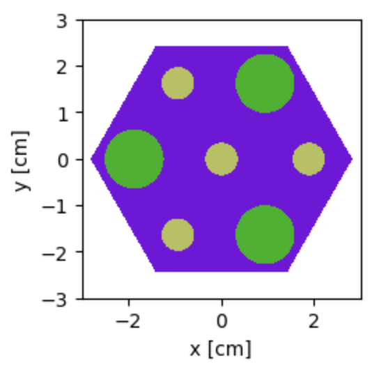
</p>
<p align="center"><i>Figure 1: Homogeneous Compact Core</i></p>

| Depletion Step | K-infinity (Heterogeneous) | Error (±) | Heterogeneous Reactivity (ρ) | Reactivity Error (±) |
| :-- | --: | --: | --: | --: |
| Init           | 1.45192 | 0.00223 | 0.311256819 | 0.001057839 |
| Step 0 (BOL)   | 1.38151 | 0.00233 | 0.276154353 | 0.001220809 |
| Step 1         | 1.31775 | 0.00244 | 0.241130715 | 0.001405154 |
| Step 10        | 1.26426 | 0.00200 | 0.20902346  | 0.001251288 |
| Step 100       | 0.98180 | 0.00183 | -0.01853738 | 0.001898476 |
| Step 254       | 0.68917 | 0.00184 | -0.451020793 | 0.003874049 |

<p align="center"><i>Table 3: K-Infinity and Reactivity Values for Heterogeneous TRISO Model Throughout Irradiation History</i></p>

| Depletion Step | K-infinity (Homogeneous) | Error (±) | Homogeneous Reactivity (ρ) | Reactivity Error |
| :-- | --: | --: | --: | --: |
| Init           | 1.37426 | 0.00243 | 0.272335657 | 0.001286674 |
| Step 0 (BOL)   | 1.35928 | 0.00257 | 0.264316403 | 0.001390962 |
| Step 1         | 1.29856 | 0.00247 | 0.229916215 | 0.001464782 |
| Step 10        | 1.24984 | 0.00204 | 0.199897587 | 0.001305934 |
| Step 100       | 0.96596 | 0.00244 | -0.035239554 | 0.002614999 |
| Step 254       | 0.66464 | 0.00216 | -0.504573905 | 0.004889684 |

<p align="center"><i>Table 4: K-Infinity and Reactivity Values for Homogeneous TRISO Model Throughout Irradiation History</i></p>

| Depletion Step | ΔP Homogeneous vs Heterogeneous (pcm) | Error (±) |
| :-- | --: | --: |
| Init         | 3892.116155 | 0.0016657 |
| Step 0 (BOL) | 1183.795004 | 0.00185072 |
| Step 1       | 1121.450035 | 0.00202979 |
| Step 10      |  912.587347 | 0.00180864 |
| Step 100     | 1670.217411 | 0.00323147 |
| Step 254     | 5355.311154 | 0.00623837 |

<p align="center"><i>Table 5: Comparison of Model Reactivities Across Timesteps</i></p>

| Model | U-235 Fission Rate (Fissions/NCC) | Error (±) | U-238 Capture Rate (Captures/NCC) | Error (±) |
| :-- | --: | --: | --: | --: |
| Homogeneous   | 0.0127193 | 5.80E-05 | 0.183559 | 0.000849643 |
| Heterogeneous | 0.0137766 | 4.97E-05 | 0.195303 | 0.000916099 |

<p align="center"><i>Table 6: U-235 Fission & U-238 Capture for Homogeneous & Heterogeneous Compact Models</i></p>

<p align="center">
  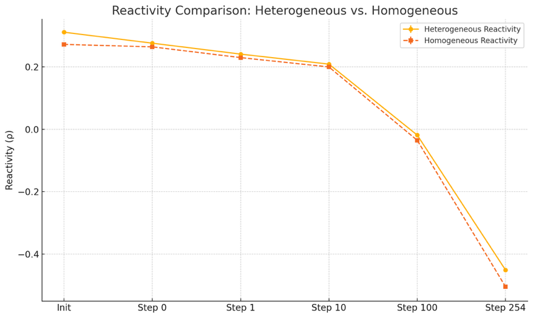
</p>
<p align="center"><i>Chart 6: Reactivity over time of homogeneous and heterogeneous compact models</i></p>

<p align="center">
  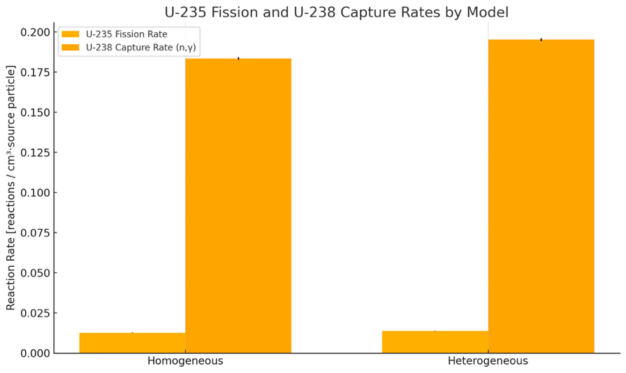
</p>
<p align="center"><i>Chart 7: Fission & Capture Rates for Homogeneous and Heterogeneous Compact Models</i></p>

### Analysis

A side-by-side comparison of explicit (heterogeneous) and fully homogenized TRISO-fuel compact models shows that the homogenization approximation consistently under-predicts both reactivity and reaction rates. At beginning-of-life the heterogeneous model yields k-infinity = 1.45192 (ρ ≈ 0.3113), whereas the homogenized model gives k-infinity = 1.37426 (ρ ≈ 0.2723). The absolute reactivity gap, Δρ ≈ 0.0390 (about 3 900 pcm), is an order of magnitude larger than the Monte Carlo uncertainty (roughly 100-200 pcm), establishing that the difference is physical rather than statistical.

That bias persists through irradiation. After a short burn (depletion step 1) the heterogeneous model remains ahead (k-infinity = 1.31775 versus 1.29856; Δρ ≈ 0.0112, about 1 120 pcm). The difference narrows to its minimum at step 10 (k-infinity = 1.26426 versus 1.24984; Δρ ≈ 0.0091, about 910 pcm) but then widens again as burnup increases. By step 100 both cores are subcritical, yet the heterogeneous compact retains ρ ≈ -0.0185 while the homogenized compact falls to ρ ≈ -0.0352; Δρ ≈ 0.0167 (about 1 670 pcm). At end-of-life (step 254) the divergence reaches Δρ ≈ 0.0536 (about 5 355 pcm), with the homogenized model under-estimating the residual reactivity by more than five percent Δk/k.

Reaction-rate tallies mirror these trends. The heterogeneous model shows an 8.3 percent higher normalized U-235 fission rate (0.0137766 versus 0.0127193) and a 6.4 percent higher U-238 (n,γ) capture rate (0.195303 versus 0.183559). These elevated rates indicate superior neutron economy in the explicit geometry: more neutrons produce fission or breed fissile Pu-239, buffering reactivity loss later in life. The homogenized calculation, by smearing fuel and moderator together, exaggerates moderation, dilutes self-shielding, and suppresses resonance absorption in U-238, leading to fewer captures, slower plutonium build-up, and a faster decline in k-infinity.

### Implications

1. **Fuel-cycle prediction**: Under-estimating reactivity by 1-5 percent Δk can shorten the calculated cycle length and prompt premature fuel discharge, leaving usable energy unexploited.
2. **Control-system sizing**: Designs based on homogenized data may call for higher initial enrichment or less boron than truly required; the real core would then start with excess reactivity, reducing shutdown and operating margins.
3. **Safety analysis fidelity**: Because geometric self-shielding and Dancoff effects are lost, the homogenized model obscures local power peaking and temperature feedback distributions vital for transient calculations.

### Conclusion

Homogenizing a doubly heterogeneous medium like TRISO fuel introduces a systematic, burnup-dependent understatement of core reactivity and key reaction rates. While convenient for rapid calculations, this simplification can misguide design and safety decisions unless compensated by self-shielding corrections or validated against explicit-geometry results. For high-accuracy work, particularly cycle-length prediction, control-rod worth, and end-of-life safety margins, explicit heterogeneous modeling (or equivalently corrected homogenized methods) remains essential.

---

<a id="problem-7"></a>
## Problem 7

> *Develop an equivalent model (that we will call Case 5) that homogenizes the TRISOs in the fuel compact and conserves fuel mass while preserving reactivity throughout irradiation history. Demonstrate the accuracy and efficiency (e.g., memory requirements and runtime) of this model, explain what the model seeks to preserve, and describe your approach.*

### Method

Initially, the RPT method employed by Kim et al. <sup>[2]</sup> was used to develop the Case 5 model. Under this method, the fuel compact is completely homogenized similar to the homogenization conducted for Problem 6, and total fuel volume is conserved, also similar to Problem 6. In this experiment, compact radius was altered in order to change the reactivity profile of the core throughout irradiation history. More precisely:

- All methods are assumed same as those used for Problem 6 unless otherwise specified.
- The original volume of the TRISO fuel material was calculated.
 , A bounding cylinder was created with the exact dimensions of the original heterogeneous fuel compact, and `openmc.model.pack_spheres()` was used to fill the bounding cylinder with TRISO material, identical to how the original heterogeneous fuel compact was created.
 , Once the compact had been packed, the number of spheres in the compact was determined. With the total volume of fuel in one TRISO ball known (volume of a sphere of radius 0.04225 cm per reactor specifications), the total volume of TRISO material in the compact could be readily calculated as $V_{\text{TRISO}} \times N_{\text{TRISO}}$. This value was calculated to be **0.8858226044976208 cc** and was held constant throughout the sensitivity analysis.
- With $V_{\text{TRISO}}$ known, the radius of the homogeneous fuel compact was altered, the new compact volumes were calculated, and $V_{\text{TRISO}}/V_{\text{Compact}}$ was used to calculate the new packing fraction for each sensitivity run.
- The proportion of each material in the fuel compact could then be calculated based on the new packing fraction and the fractions of each fuel in a single TRISO sphere:

$$\text{Compact Fraction}_{\text{Material}} = \text{TRISO Fraction}_{\text{Material}} \times \text{New PF}$$

- With the relative fractions of each material known, the nuclide densities in atoms/b-cm for the entire compact could be calculated using the method outlined in Problem 6, and the core could be run at the new compact radius.
- Different core radii were simulated in fast 300-particle, 60-batch depletion simulations in order to get a qualitative sense for reactivity sensitivity to compact radius; core radii of 0.47 cm, 0.635 cm, and 0.8 cm were tested in this manner.
- It was determined that the 0.8 cm depletion run had very close $K_{\text{Inf}}$ values to the original heterogeneous model, and $r_{\text{compact}} = 0.8 \text{ cm}$ was simulated with 2 000 particles and 10 batches per timestep in a depletion simulation.
- Values for $r_{\text{compact}} = 0.635 \text{ cm}$, calculated for Problem 6, were included for the homogeneous model in order to provide a baseline comparison between the heterogeneous and homogeneous 0.635 cm compacts.
- It was experimentally determined that the RPT method would be insufficient for matching the reactivity trend of the heterogeneous TRISO compact, and a version of the **Ring Reactivity-Equivalent Physical Transformation (RRPT)** method discussed by Kzgui et al. <sup>[3]</sup> and described by Loe et al. <sup>[4]</sup> was implemented.

---

- Under the RRPT methodology used for this experiment, the TRISO compact in suspension of graphite was semi-homogenized into rings of fuel and moderator material, occupying the core in a growing series of cylinders representing each layer of compact material.
- The TRISO fuel was homogenized using the methodology outlined in Problem 6, but was not homogenized with the graphite moderator within the fuel compact as was the case in Problem 6.
 , A new material was introduced named `RRPT_mat`. This material was created using the same homogenization technique described in Problem 6, but used the TRISO-level fractions and densities of individual nuclides as opposed to the compact-level fractions used in Problem 6. As well, `RRPT_mat` featured only the graphite within the TRISO spheres, not the moderator graphite. Recall that the TRISO-level fractions were computed as a necessary intermediate step to obtain the compact-level fractions.
 , Compact moderator graphite fraction was calculated using the same methodology as in Problem 6.
- The RRPT compact design featured an inner cylinder of moderator graphite followed by an inner ring of homogenized TRISO fuel material, a middle ring of moderator graphite, an outer ring of fuel material, and a final outer ring of moderator graphite.

<p align="center">
  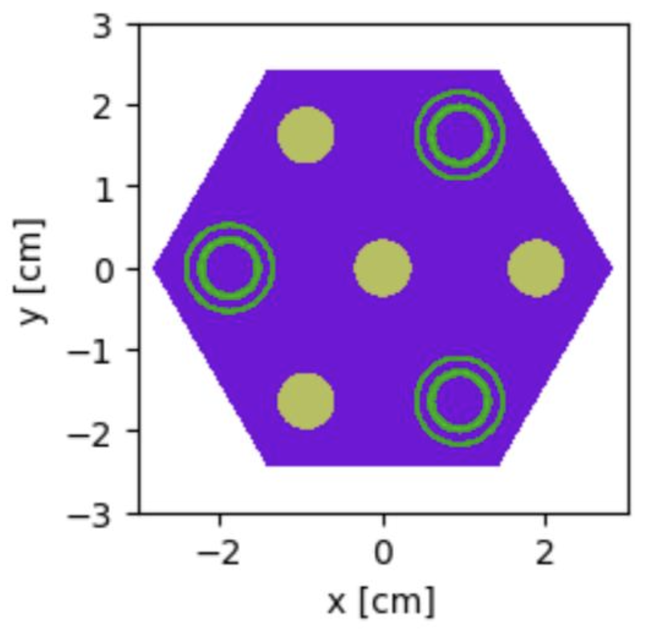
</p>
<p align="center"><i>Figure 2: 33/33/33 Graphite Allocation, 50/50 Inner/Outer Ring Fuel Allocation Reactor Core</i></p>

- Based on the calculated volumes of moderator and fuel, as well as the desired weighting of fuel material between outer and inner fuel rings, ring radii were defined. The equation for calculation of ring radii is as follows:

$$\text{Layer Radius} = \left( \sum \text{Ring Fraction}_{\text{Material}} \right) \times \text{Compact Radius}$$

  where $\sum \text{Ring Fraction}_{\text{Material}}$ represents the summation of all TRISO fractions for all materials whose layers lie inside the radius being calculated, and $\text{Ring Fraction}_{\text{Material}}$ represents the $\text{TRISO Fraction}_{\text{Material}}$ value multiplied by the ring weighting for that material.

- As there are three equally volume-weighted graphite rings, in all graphite moderator cases $\text{TRISO Fraction}_{\text{Material}}$ was multiplied by 0.3333. Inner and outer fuel-ring $\text{TRISO Fraction}_{\text{Material}}$ values were multiplied by `inner_fuel_allocation` and `(1 − inner_fuel_allocation)` respectively, where `inner_fuel_allocation` represents the fraction of total fuel material allocated to the inner fuel ring.
- Ring radii and fuel compact height were used to define `ZCylinder`s within OpenMC; those cylinders were then used to create cells within OpenMC bounded by the cylinders directly exterior and interior to the cylinder in question, creating correctly-sized rings for each layer of compact material. Materials were added to their respective rings.
- `inner_fuel_allocation` was parameterized such that it can be iteratively altered to find the optimal core design to mimic the reactivity profile of the original heterogeneous compact simulation.
- Full-fidelity depletion simulations were run with 2 000 particles and 100 batches for a 50/50 weighting of fuel material between the outer and inner fuel rings, a 70/30 weighting, and a 30/70 weighting to gain intuition as to the sensitivity of core reactivity profile to ring weighting across irradiation history.
- Simulations were analyzed and it was determined that equal weighting of the graphite rings insufficiently decoupled the two fuel rings, and shifting fuel allocation did not produce meaningful shifts in reactivity.

---

- Graphite ring allocation was altered such that the outer graphite ring contained 10 % of total compact moderator graphite, the middle ring contained 80 %, and the inner graphite cylinder contained 10 % of total compact moderator graphite.
- The 50/50, 70/30, and 30/70 fuel-ring material allocation depletion simulations were repeated with the increased separating graphite between the outer and inner fuel rings.
- Preliminary data was analyzed and trends in the data were extrapolated. As none of the RRPT cores managed to mimic the reactivity profile over irradiation history of the heterogeneous core, one more depletion simulation was run with all parameters set to the values that would bring the RRPT core the most in alignment with the heterogeneous core under the simulation constraints of this RRPT methodology. This was a full depletion simulation with **1/99 inner/outer fuel ring material allocation** and **1/98/1 inner/middle/outer moderator ring material allocation**.

<p align="center">
  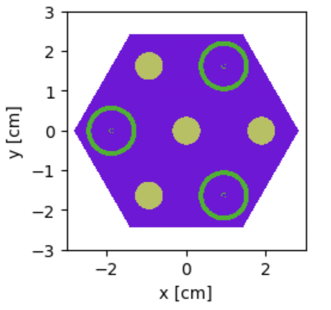
</p>
<p align="center"><i>Figure 3: 1/98/1 Graphite Allocation, 99/1 Inner/Outer Ring Fuel Allocation Reactor Core</i></p>

- Results were compiled and discussed.

### Results

**Heterogeneous Compact (benchmark)**

| Radius (cm) | Init | Step 0 (BOL) | Step 1 | Step 10 | Step 100 | Step 254 |
| --: | :-- | :-- | :-- | :-- | :-- | :-- |
| 0.635 | 1.45192 ± 0.00223 | 1.38151 ± 0.00233 | 1.31775 ± 0.00244 | 1.26355 ± 0.00254 | 0.98180 ± 0.00183 | 0.68917 ± 0.00184 |

<p align="center"><i>Table 7: Benchmark K-Infinity Values for Heterogeneous TRISO compact across depletion history</i></p>

**RPT Homogeneous Compact, 300/60 Particles/Batches**

| Radius (cm) | Init | Step 0 (BOL) | Step 1 | Step 10 | Step 100 | Step 254 |
| --: | :-- | :-- | :-- | :-- | :-- | :-- |
| 0.47  | 1.45332 ± 0.00926 | 1.44595 ± 0.00726 | 1.38814 ± 0.00880 | 1.34179 ± 0.00870 | 1.00747 ± 0.01053 | 0.67735 ± 0.00625 |
| 0.635 | 1.41543 ± 0.00830 | 1.39939 ± 0.00958 | 1.33465 ± 0.00940 | 1.29073 ± 0.00810 | 0.99908 ± 0.00851 | 0.69634 ± 0.00746 |
| 0.8   | 1.38997 ± 0.00904 | 1.38179 ± 0.00915 | 1.31120 ± 0.00899 | 1.27429 ± 0.00906 | 0.98077 ± 0.00916 | 0.68528 ± 0.00916 |

<p align="center"><i>Table 8: K-Infinity Values for Fast Homogeneous Depletion Simulations for Three Compact Radii</i></p>

**RPT Homogeneous Compact, 2000/100 Particles/Batches**

| Radius (cm) | Init | Step 0 (BOL) | Step 1 | Step 10 | Step 100 | Step 254 |
| --: | :-- | :-- | :-- | :-- | :-- | :-- |
| 0.635 | 1.37426 ± 0.00243 | 1.35928 ± 0.00257 | 1.29856 ± 0.00247 | 1.24984 ± 0.00204 | 0.96596 ± 0.00244 | 0.66464 ± 0.00216 |
| 0.8   | 1.38937 ± 0.00261 | 1.38076 ± 0.00217 | 1.31801 ± 0.00273 | 1.26558 ± 0.00224 | 0.98333 ± 0.00203 | 0.69071 ± 0.00224 |

<p align="center"><i>Table 9: K-Infinity Values for Full Homogeneous Depletion Simulations for Two Compact Radii</i></p>

<p align="center">
  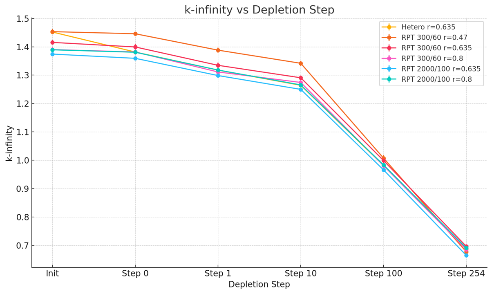
</p>
<p align="center"><i>Chart 8: Comparison of K-Infinity Values for RPT Simulations Benchmarked Against Heterogeneous Model</i></p>

<p align="center">
  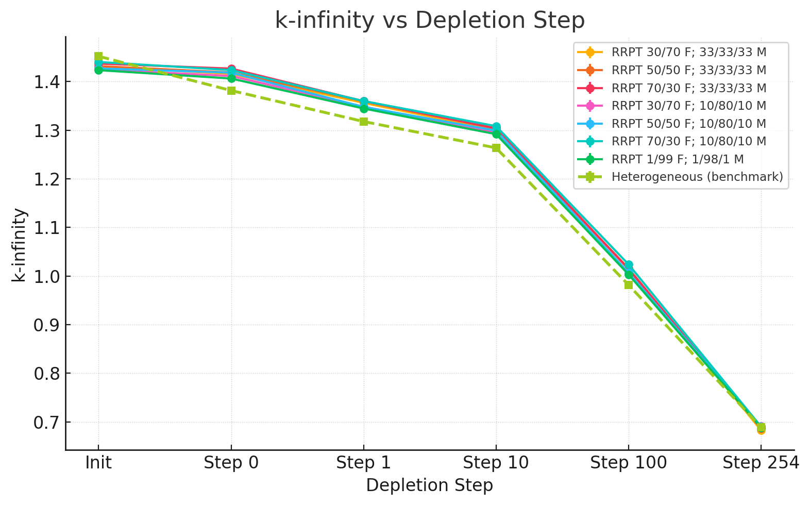
</p>
<p align="center"><i>Chart 9: Comparison of K-Infinity Values for RRPT Simulations Benchmarked Against Heterogeneous Model</i></p>

| Step | Homogeneous RPT | Heterogeneous (benchmark) | Semihomogeneous RRPT | Homogeneous RPT ΔP (pcm) | Semihomogeneous RRPT ΔP (pcm) |
| :-- | :-- | :-- | :-- | --: | --: |
| Init           | 0.280249322 ± 0.001352087 | 0.311256819 ± 0.001057839 | 0.297466665 ± 0.001189463 | 3 100.749692 ± 172 |  1 379.015376 ± 159 |
| Step 0 (BOL)   | 0.275761175 ± 0.001138212 | 0.276154353 ± 0.001220809 | 0.288893946 ± 0.001011344 |    39.317784 ± 167 | -1 273.959280 ± 159 |
| Step 1         | 0.241280415 ± 0.001571539 | 0.241130715 ± 0.001405154 | 0.256262272 ± 0.001255641 |   -14.969994 ± 211 | -1 513.155644 ± 188 |
| Step 10        | 0.209848449 ± 0.001398520 | 0.208579004 ± 0.001590922 | 0.225922314 ± 0.001252320 |  -126.944533 ± 212 | -1 734.330996 ± 202 |
| Step 100       | -0.016952600 ± 0.002099411 | -0.018537380 ± 0.001898476 | 0.003279211 ± 0.002592911 | -158.478048 ± 283 | -2 181.659172 ± 321 |
| Step 254       | -0.447785612 ± 0.004695226 | -0.451020793 ± 0.003874049 | -0.452960407 ± 0.004897738 | -323.518122 ± 609 |    193.961370 ± 624 |

<p align="center"><i>Table 10: Comparison of Reactivity Values for 0.8 cm Homogeneous Compact, 0.635 cm Heterogeneous Compact, and 1/99; 1/98/1 RRPT Compact</i></p>

<p align="center">
  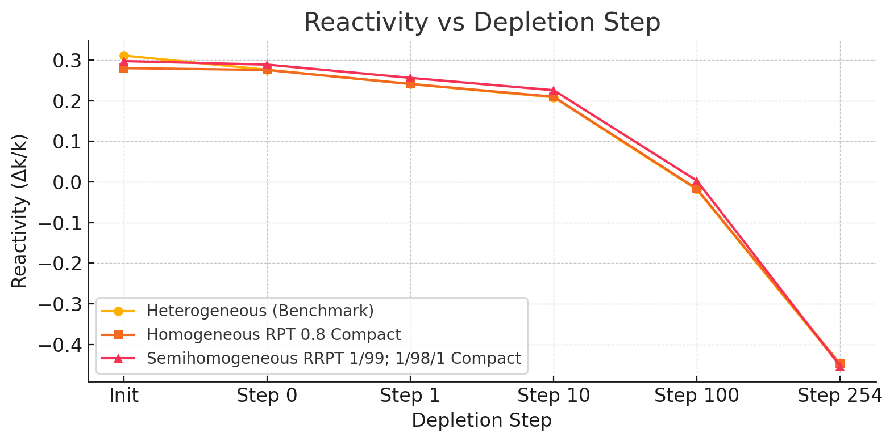
</p>
<p align="center"><i>Chart 10: Reactivity vs. Depletion Step for RPT & RRPT Compacts that Performed Closest to Benchmark Heterogeneous Compact</i></p>

### Discussion

The homogeneous RPT model exhibited significant deviations in reactivity behavior compared to the true heterogeneous TRISO lattice. At beginning-of-life, a fully homogenized compact with the nominal 35 % packing fraction underestimates k∞ by on the order of a few thousand pcm. This deficit arises from the loss of double-heterogeneity effects. In the explicit TRISO geometry, each fuel kernel is surrounded by graphite, so many neutrons escape the immediate fuel micro-region and thermalize in the moderator before encountering fuel again. This configuration naturally self-shields resonances, U-238 absorption is partially avoided, and thus more neutrons reach thermal energies where they can cause U-235 fission. In a single-region homogenized model, by contrast, fuel and graphite are uniformly mixed at the compact scale. Neutrons cannot avoid fuel during moderation, leading to more frequent resonance encounters and parasitic absorptions in U-238. The result is an effectively harder neutron spectrum (less-moderated on average) in the homogenized case for the same bulk packing fraction, which suppresses reactivity relative to the heterogeneous system. Graphite moderation in the real TRISO lattice is simply more effective, neutrons experience a purer moderator environment between fuel collisions, whereas in the RPT core every slowing-down step still occurs in a fuel-containing medium. These spectral differences explain why the initial k∞ of the homogeneous model is so much lower despite identical fuel loading.

To compensate for this reactivity shortfall, the RPT methodology adjusts the fuel geometry (and thus the moderation ratio) in the homogeneous model. By shrinking the fuel compact radius to increase the packing fraction, the homogeneous k∞ can be raised to match the benchmark at a particular point in time. Indeed, using a much smaller compact (r ≈ 0.47 cm, ~64 % packing) the RPT model's initial multiplication factor was brought in line with the heterogeneous case. This improvement, however, comes at the cost of a **harder spectrum** due to the greatly reduced graphite fraction. Conversely, a larger-than-normal compact (r ≈ 0.80 cm, ~22 % packing) over-moderates the system, softening the spectrum and further lowering initial k∞. As observed in earlier packing-fraction sensitivity tests, there is an optimal moderation range around 30-40 % packing; too much fuel or too little fuel both degrade performance. The heterogeneous core (35 % packing) sits near this sweet spot for fresh fuel, whereas the simple RPT models at 22 % or 64 % represent under- and over-moderated extremes. Thus, while a high-packing (hard spectrum) homogeneous model can be tuned to match the starting reactivity, it will not follow the same depletion trajectory as the real core.

Reactivity evolution in the RPT model diverges from the heterogeneous case because of spectral shifts and fuel utilization differences over time. The TRISO lattice's initial reactivity advantage, earned by avoiding many resonance captures, begins to diminish as burnup progresses. With fewer U-238 absorptions early on, the heterogeneous core produces less Pu-239 in the first cycles. Its reactivity therefore drops off faster once the initial U-235 inventory is depleted. The RPT model, especially a high-packing variant, does the opposite: it sacrifices some early reactivity by absorbing more neutrons in U-238, but in doing so it breeds extra Pu-239 that later contributes fissions. In effect, the homogeneous core "flattens" the reactivity curve, declining more gradually. For example, an RPT compact calibrated to match k-infinity at BOL will tend to over-predict reactivity in mid-life relative to the heterogeneous benchmark (having more fissile Pu available), whereas a model tuned to EOL will under-predict the initial excess reactivity. No single static packing fraction can reproduce the entire k∞ vs. burnup profile, since the heterogeneous core's moderation efficiency and absorption balance shift as fuel is consumed. This was evident in our tests: the 0.47 cm RPT case that matched k-infinity at startup ended up several hundred pcm above the benchmark by intermediate burnup, while the 0.80 cm case that matched BOL reactivity started almost 4 500 pcm below the benchmark initially (and only converged near end-of-life). In short, a one-region homogenization cannot simultaneously preserve both the strong initial reactivity and the faster late-life downturn of the TRISO system.

The RRPT semi-homogeneous model was introduced to bridge this gap by better capturing the spatial moderation characteristics of the TRISO fuel. Instead of smearing the entire compact into a single homogeneous mixture, the RRPT approach preserves a degree of structural heterogeneity: the compact is divided into concentric zones of graphite and fuel, emulating the idea of fuel "rings" suspended in moderator. In our implementation, an inner graphite cylinder is surrounded by an inner fuel ring, then a thick graphite ring, an outer fuel ring, and finally an outer graphite shell, effectively a layered fuel compact. Neutrons born in the fuel rings must travel through explicit graphite regions before reaching another fuel region, much as they would leaving a real TRISO kernel and streaming through the graphite matrix. This design seeks to preserve the moderation and self-shielding environment of the heterogeneous lattice (hence "reactivity-equivalent" transformation). By not homogenizing fuel and graphite into one region, the RRPT model allows thermalization to occur in graphite-rich layers that are largely decoupled from fuel, leading to a more thermal spectrum in and around those graphite layers and fewer resonance captures.

Achieving a close reactivity match with RRPT required tuning the relative sizes of the rings and the fuel distribution between them. Initial trials allocated graphite evenly to the three moderator regions (33/33/33 % of the total moderator each) and split the fuel 50/50 between inner and outer rings. This configuration did produce a higher initial k-infinity than the single-region model, but it still did not perfectly trace the benchmark as burnup progressed. It was observed that with equal graphite rings, the two fuel rings remained insufficiently isolated, neutrons could readily migrate between fuel zones, so the spectrum in each was too similar and the benefits of double-heterogeneity were muted. In fact, simply shifting the fuel split (e.g. 70/30 vs 30/70) under that equal-moderator design yielded only minor reactivity changes, indicating that the inner and outer fuel regions were strongly coupled by the intervening graphite. To enforce a greater spectral separation, we increased the moderator content in the middle ring dramatically (to 80 % of total graphite, leaving only 10 % in the inner plug and 10 % at the periphery). This heavy central moderator effectively shields the inner fuel ring from the outer ring. Fast neutrons leaving the outer fuel have a high probability of thermalizing in the thick middle graphite before ever reaching the inner fuel, and vice versa. With this 10/80/10 graphite layout, altering the fuel allocation between rings now had a pronounced effect on reactivity, a clear sign that the rings were decoupled enough to behave more like independent fuel zones.

Using the 10/80/10 moderator scheme, we tested various fuel splits and identified an extreme configuration that best mimicked the heterogeneous core's behavior: only 1 % of the fuel in the inner ring and 99 % in the outer ring (essentially all fuel pushed toward the outer compact radius). This RRPT variant came the closest to preserving reactivity throughout depletion. Physically, concentrating fuel in the outer annulus means neutrons born in that fuel have the maximum amount of graphite between them and any other fuel, closely resembling a scenario where each kernel is surrounded by moderator. The inner 1 % fuel provides a minimal central source, while the vast majority of the fission occurs in the outer region after neutrons have had a chance to thermalize. As a result, the initial reactivity error was greatly reduced, the semi-homogeneous core was within roughly 1-1.5 % delta-k of the true lattice at startup, a substantial improvement over the simple homogeneous error (~3 % low). Moreover, by end-of-life the 1/99 fuel-split RRPT model's k∞ essentially converged with the heterogeneous value (within ~200 pcm). This indicates that the RRPT geometry successfully reproduces not just the starting excess reactivity but also the proper depletion trend to a large extent. The reason is that the RRPT core, like the real one, avoids over-absorbing neutrons in U-238 early on and therefore does not artificially bolster Pu production, it burns down U-235 and builds up Pu at a rate much closer to the heterogeneous fuel. The neutron absorption pattern (between U-235 consumption and U-238 conversion) is thus more realistic in the ring model.

Despite these improvements, small discrepancies remained. Notably, the RRPT model tended to overpredict reactivity through the middle of the cycle (by up to ~1 500-2 000 pcm around peak burnup in our tests). This overshoot suggests that the chosen ring configuration slightly under-moderated the system during mid-burn or otherwise did not capture the evolving spectrum perfectly, perhaps the fuel distribution and ring sizes that were optimal at BOL became suboptimal as the fissile composition shifted. It's possible that the inner fuel ring (though only 1 % of fuel) still introduced a mild spectral hardening effect that mattered once Pu-239 began to accumulate, or that fission product poisonings in the heterogeneous core weren't fully mirrored. In any case, the trend was that the RRPT core held reactivity too high in the middle of life, then finally dipped just below the benchmark by the very end. The homogeneous RPT core showed the opposite behavior (too low initially, then generally flattening out and ending slightly above the benchmark). Between the two, the RRPT approach clearly captured the endpoints much better and overall provided a more realistic reactivity curve, but it could not achieve a perfect match at every point in time. This reflects the challenge of any static transformation method: the neutron spectrum and reaction rates in an actual burnup scenario evolve in complex ways that a fixed geometric adjustment can only approximate.

---

<a id="problem-8"></a>
## Problem 8

### Method

To benchmark a deterministic lattice solver against continuous-energy Monte Carlo for TRISO-fueled systems, *Case 5* was analyzed in CASMO with two geometrical treatments:

- **Fully homogenized compact** (fuel and moderator smeared into a single zone)
- **Semi-homogeneous RRPT compact** (fuel and graphite split into concentric rings that approximate the radial moderation profile of a TRISO assembly)

### Results

<p align="center">
  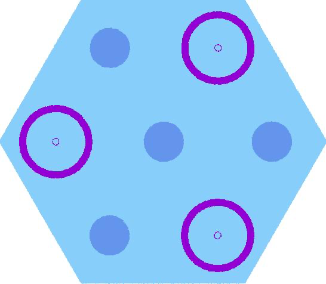
  &nbsp;&nbsp;
  
</p>
<p align="center"><i>Figure 4: CASMO Simulated RRPT Semi-homogeneous Reactor Core (0.01/0.99 Inner/Outer Fuel Rings, 0.01/0.98/0.01 Inner/Middle/Outer Graphite Rings) & CASMO Simulated Homogeneous 0.8 cm Radius Core Compact</i></p>

| Model | k-eff (CASMO) |
| :-- | :-- |
| Homogenized compact | 1.482 19 |
| RRPT compact        | 1.714 48 |

<p align="center"><i>Table 11: CASMO Model Results</i></p>

| Model | Time (s) | Memory (Mb) |
| :-- | --: | --: |
| Heterogeneous | 767 | 346.38 |
| RRPT          |  95 |   6.22 |

<p align="center"><i>Table 12: Model Speed & Memory Usage Comparison</i></p>

> **Note:** Benchmarking conducted for initial steady-state simulation of RRPT and heterogeneous fuel compacts. More robust benchmarking was desired, but lack of cluster time / access limited capacity to do so.

Adopting the Reduced-Resolution Pin Transport (RRPT) model in place of the fully heterogeneous core simulation reduces the wall-clock time from **767 s to 95 s**, corresponding to an approximate **87.6 percent acceleration**, while simultaneously decreasing peak resident memory from **346 MB to 6 MB**: an overall reduction of roughly two orders of magnitude. These improvements are not merely convenient; they are indispensable for modern reactor design workflows that rely on repeated parametric sweeps, multi-objective optimisation, and rigorous uncertainty quantification, all of which demand thousands of core calculations.

Faster runtimes enable tighter design-feedback loops, allowing engineers to evaluate fuel-management strategies or safety margins on commodity hardware rather than costly high-performance clusters. The dramatically smaller memory footprint also facilitates concurrent execution of many cases in ensemble studies and reduces energy consumption, an increasingly important metric for sustainable computational practice. In short, the RRPT approximation offers a scientifically defensible compromise between fidelity and efficiency, unlocking high-throughput analyses that would be prohibitively expensive with a strictly heterogeneous representation.

The RRPT methodology raises reactivity by ≈ 0.232 Δk (≈ 23 000 pcm) relative to the fully smeared model, evidence that restoring radial heterogeneity recovers physics lost during homogenization.

### Analysis

To assess how accurately (and how quickly) a deterministic lattice code can treat a TRISO-fueled assembly, I analyzed Case 5 in CASMO under two geometrical assumptions. In the first, the entire compact was smeared into a single homogeneous material; in the second, a semi-homogeneous Ring Reactivity-Equivalent Physical Transformation (RRPT) model recreated the compact as alternating fuel and graphite rings. CASMO reported k_eff = 1.482 19 for the fully smeared compact and k_eff = 1.714 48 for the RRPT layout, an upward shift of roughly 23 000 pcm once radial heterogeneity is restored. That jump is precisely what physics predicts: segregating fuel from moderator rebuilds the moderation pattern and self-shielding that exist in a genuine TRISO matrix, whereas total homogenization forces every slowing-down collision to occur inside fuel, hardens the spectrum in the intermediate range, and suppresses reactivity.

The RRPT geometry erects explicit graphite "gaps" between concentric fuel zones, so neutrons can thermalize outside fuel before returning, partly shielding U-238 resonances and boosting the fission rate. The uniform model, by contrast, immerses fertile isotopes in a flux rich in 0.1-10 keV neutrons; those neutrons encounter broad U-238 cross-section peaks with no graphite buffer, producing excessive resonance capture and an artificially low multiplication factor.

Across both geometries, CASMO's eigenvalues sit about 2 000-3 000 pcm higher than their OpenMC counterparts. The offset reflects methodological, not geometric, differences. OpenMC tracks every collision in continuous energy, fully resolving resonance structure, thermal scattering, and graphite slowing-down; CASMO collapses the spectrum into only two energy groups and relies on multigroup self-shielding factors, a coarser treatment that can oversoften the flux in graphite-moderated, salt-cooled media. When resonance behavior and spectral hardness drive reactivity, that coarse grouping tends to overshoot.

Crucially, the two codes agree on the trend even if they differ in absolute magnitude: adding RRPT heterogeneity restores a large block of reactivity lost in the smeared model. This consistency confirms that RRPT successfully recovers the most important spectral and spatial effects even inside a deterministic solver. In practice, CASMO's speed and frugal memory make it ideal for parametric sweeps, provided the analyst applies an RRPT (or equivalent) correction and benchmarks the final design against high-fidelity Monte Carlo. Continuous-energy tools such as OpenMC remain indispensable for ultimate verification, especially for reactors that marry graphite moderation with non-light-water coolants, but the RRPT-enhanced deterministic approach offers a reliable, time-saving surrogate during early design.

---

<a id="appendix"></a>
## Appendix

<p align="center">
  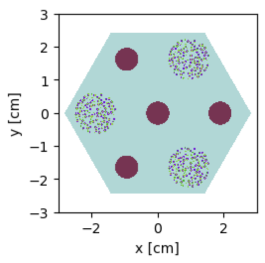
</p>
<p align="center"><i>Figure 5: Baseline Heterogeneous TRISO Compact Reactor Core</i></p>

<p align="center">
  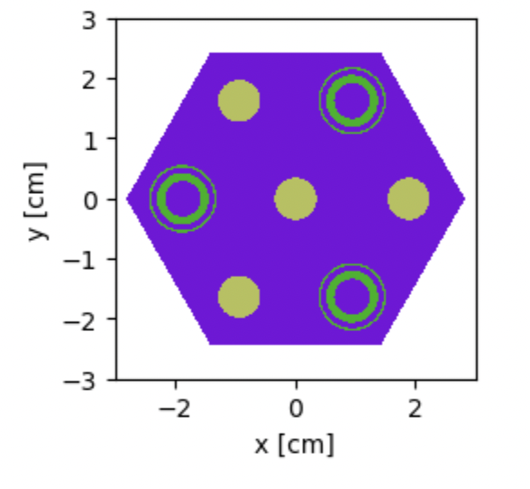
</p>
<p align="center"><i>Figure 6: 33/33/33 Graphite Allocation, 70/30 Inner/Outer Ring Fuel Allocation Reactor Core</i></p>

<p align="center">
  
</p>
<p align="center"><i>Figure 7: 33/33/33 Graphite Allocation, 30/70 Inner/Outer Ring Fuel Allocation Reactor Core</i></p>

<p align="center">
  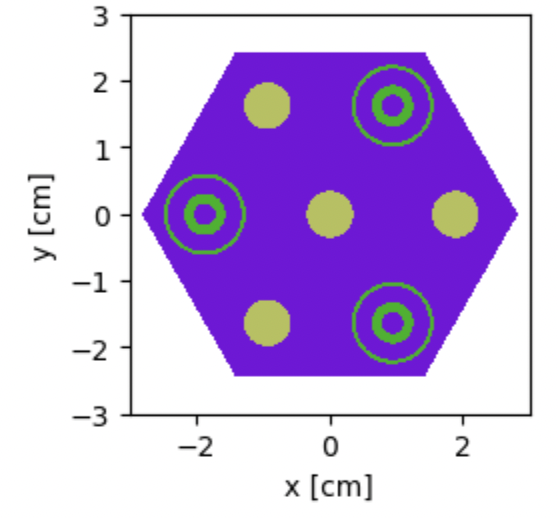
</p>
<p align="center"><i>Figure 8: 10/80/10 Graphite Allocation, 50/50 Inner/Outer Ring Fuel Allocation Reactor Core</i></p>

<p align="center">
  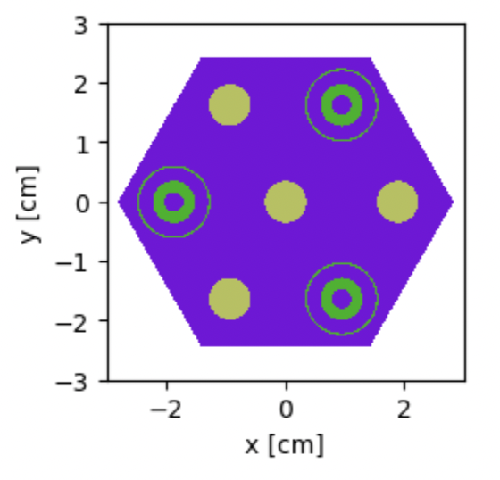
</p>
<p align="center"><i>Figure 9: 10/80/10 Graphite Allocation, 70/30 Inner/Outer Ring Fuel Allocation Reactor Core</i></p>

<p align="center">
  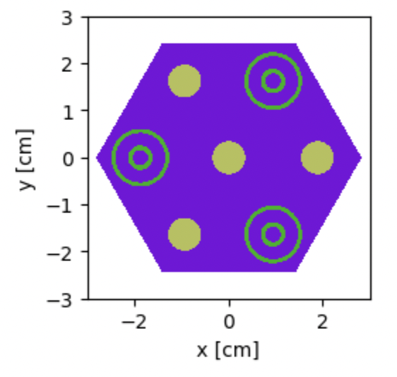
</p>
<p align="center"><i>Figure 10: 10/80/10 Graphite Allocation, 30/70 Inner/Outer Ring Fuel Allocation Reactor Core</i></p>

---

<a id="sources-cited"></a>
## Sources Cited

1. Calegario, G. L., Pereira, C., & Silva, C. A. M. (2025, April 19). *Evaluation of molten-salt coolant characteristics for small modular reactors* (Version 1) [Preprint]. ChinaXiv. <https://chinaxiv.org/user/view.htm?uuid=4f4754e7-e64c-46ce-8df5-91a6a6bf8bc6&filetype=pdf>
2. Y. Kim, K. Kim, and J. Noh, "Reactivity-equivalent physical transformation for homogenization of double-heterogeneous fuels," *Transactions of the Korean Nuclear Society Autumn Meeting*, October 2005. <https://www.kns.org/files/pre_paper/17/84.pdf>
3. Kristina. (2023). *Neutronic analysis of a horizontal-compact high-temperature gas-cooled reactor* (Master's thesis, Massachusetts Institute of Technology).
4. L. Lou, X. Chai, D. Yao, X. Peng, L. Chen, M. Li, Y. Yu, and L. Wang, "Research of ring-RPT method on spherical and cylindrical double-heterogeneous systems," *Ann. Nucl. Energy*, vol. 147, November 2020. <https://doi.org/10.1016/j.anucene.2020.107741>

---

## Repository Structure

```
MSR-Core-Simulation/
├── README.md
├── Reactor_Phys_Final.docx        # Original final-report document
├── figures/media/                 # All figures and charts referenced above
└── Final_Code_211/                # OpenMC / CASMO source notebooks and inputs
    ├── Problem1a.ipynb … Problem7.ipynb
    ├── Homogeneous.inp
    └── RRPT.inp
```
